<picture>
  <source media="(max-width: 600px)" srcset="assets/header-mobile.svg">
  <source media="(prefers-reduced-motion: reduce)" srcset="assets/header-static.svg">
  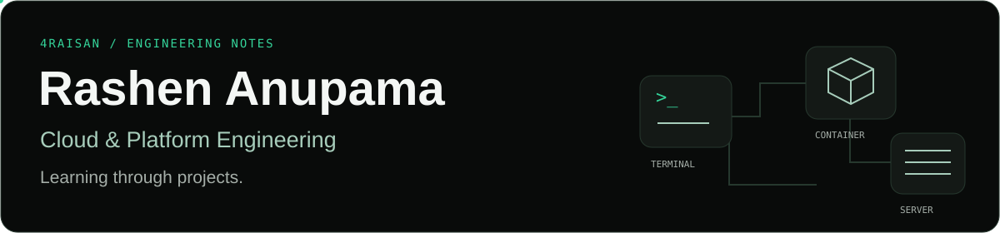
</picture>

**Rashen Anupama · Cloud & Platform Engineering**  
IT undergraduate at SLTC Research University.  
Working on Luxora and tools for local development.  
Moving toward cloud infrastructure, automation, and IAM.

### Selected work

[**Luxora ↗**](https://github.com/4Raisan/Luxora_v1)

<a href="https://github.com/4Raisan/Luxora_v1"><picture>
  <source media="(max-width: 600px)" srcset="assets/luxora-mobile.svg">
  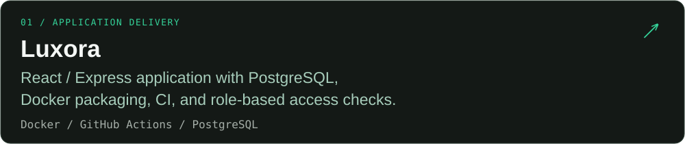
</picture></a>

[Container build](https://github.com/4Raisan/Luxora_v1/blob/main/Dockerfile) · [CI and current results](https://github.com/4Raisan/Luxora_v1/actions/workflows/ci.yml) · [Access checks](https://github.com/4Raisan/Luxora_v1/blob/main/backend/src/middleware/auth.js)

[**cosplay-proxy ↗**](https://github.com/4Raisan/cosplay-proxy)

<a href="https://github.com/4Raisan/cosplay-proxy"><picture>
  <source media="(max-width: 600px)" srcset="assets/cosplay-proxy-mobile.svg">
  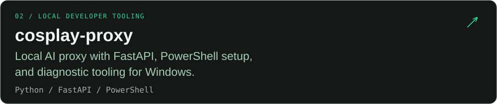
</picture></a>

[Setup and architecture](https://github.com/4Raisan/cosplay-proxy#readme)

### Tools used in these projects

  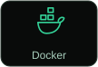
  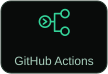
  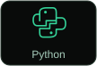
  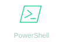
  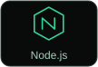
  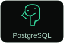

These tools reflect work in the repositories above. Cloud infrastructure and IAM are the direction I’m developing toward; the project links show what I’ve built so far.

### GitHub activity

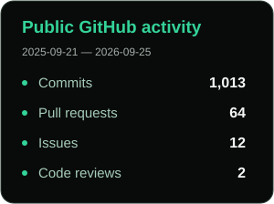


Public activity, refreshed daily. <!-- activity-date -->First refresh pending<!-- /activity-date -->. Activity counts describe participation, not skill level.

### Contact

[Email me](mailto:mn4raisan@gmail.com) · [Browse my repositories](https://github.com/4Raisan?tab=repositories)
