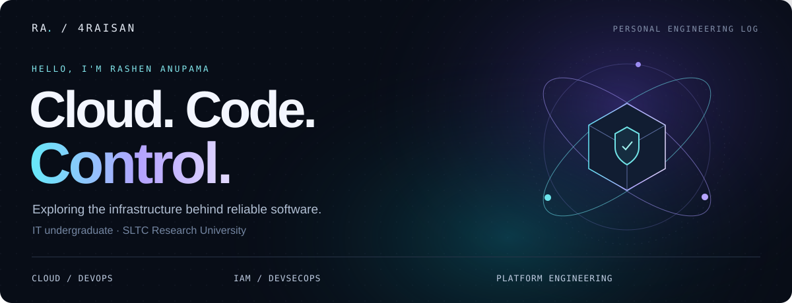
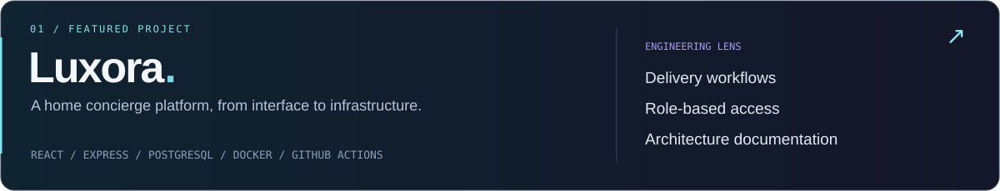

<a href="https://github.com/4Raisan/Luxora_v1"><b>Explore my work ↗</b></a> &nbsp; · &nbsp; <a href="mailto:mn4raisan@gmail.com">Get in touch</a> &nbsp; · &nbsp; <a href="https://github.com/4Raisan?tab=repositories">All repositories</a>

<h2>Cloud-focused undergraduate. Aspiring platform engineer.</h2>

I'm <b>Rashen Anupama</b>, an IT undergraduate at <b>SLTC Research University</b>, building toward a career in <b>cloud infrastructure, automation, and secure developer platforms</b>.

I'm interested in the engineering behind a running service: reproducible environments, reliable delivery, and well-defined access. My direction brings together <b>Cloud &amp; DevOps, platform engineering, IAM security, and DevSecOps</b>.

<h2>Selected work</h2>

Luxora connects customers, service providers, and administrators through booking and service-delivery workflows. The repository includes:

<table>
<tr><th align="left">Delivery</th><th align="left">Access</th><th align="left">Architecture</th></tr>
<tr><td>GitHub Actions, Docker configuration, and documented test and build checks.</td><td>Backend authentication, role checks, and KYC checks across user workflows.</td><td>API documentation, a codebase knowledge graph, and an architecture explorer.</td></tr>
</table>

<a href="https://github.com/4Raisan/Luxora_v1">Source code ↗</a> &nbsp; · &nbsp; <a href="https://github.com/4Raisan/Luxora_v1/blob/main/docs/CI.md">Delivery workflow ↗</a> &nbsp; · &nbsp; <a href="https://github.com/4Raisan/Luxora_v1/blob/main/docs/architecture/TECHNICAL_ARCHITECTURE_AND_SYSTEM_DOCUMENTATION.md">Architecture ↗</a>

MVP stage. External production integrations still need live-environment validation; see the <a href="https://github.com/4Raisan/Luxora_v1/blob/main/docs/planning/roadmap.md">project roadmap</a>.

<h2>Engineering foundation</h2>

<b>Automation foundations:</b> Python · Bash · SQL.

<b>Delivery in Luxora:</b> Docker configuration · GitHub Actions · documented test and build checks.

<b>Deployment architecture:</b> Vercel frontend · Northflank API · Neon PostgreSQL.

<b>Application context:</b> React, Express, and Prisma connect the product to its runtime and data layer.

<h2>My platform engineering roadmap</h2>

<b>Cloud foundations → Infrastructure as Code → Containers → CI/CD → Kubernetes → Developer platforms</b>

Security runs through the whole path: identity, least privilege, secrets handling, and delivery checks.

The priorities below describe where I'm developing next, rather than a list of completed qualifications.

<table>
<tr><th align="left">Cloud &amp; platforms</th><th align="left">Identity &amp; secure delivery</th></tr>
<tr><td>AWS, Linux &amp; networking foundations Terraform &amp; reproducible infrastructure Docker, CI/CD &amp; Kubernetes Developer workflows &amp; observability</td><td>IAM &amp; identity lifecycles Least-privilege access Secrets management Cloud security &amp; security checks in CI/CD</td></tr>
</table>

<b>More from my learning notebook</b>

 
<ul><li><a href="https://github.com/4Raisan/study-JAVA">Java &amp; OOP fundamentals</a></li><li><a href="https://github.com/4Raisan/py-Libraries">Exploring Python libraries</a></li><li><a href="https://github.com/4Raisan/Tkinter-GUI-making-">Python GUI experiments</a></li></ul>

<b>Interested in cloud, security, or developer platforms?</b> <a href="mailto:mn4raisan@gmail.com">Let's connect ↗</a>

